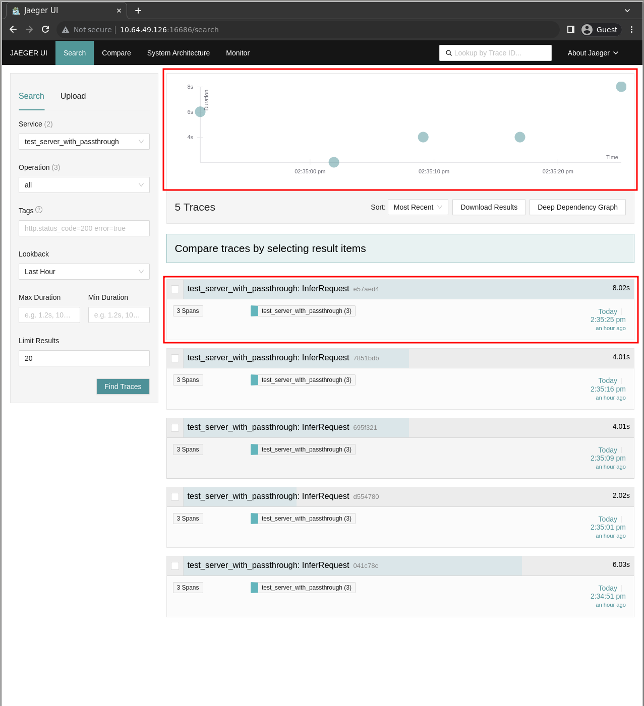
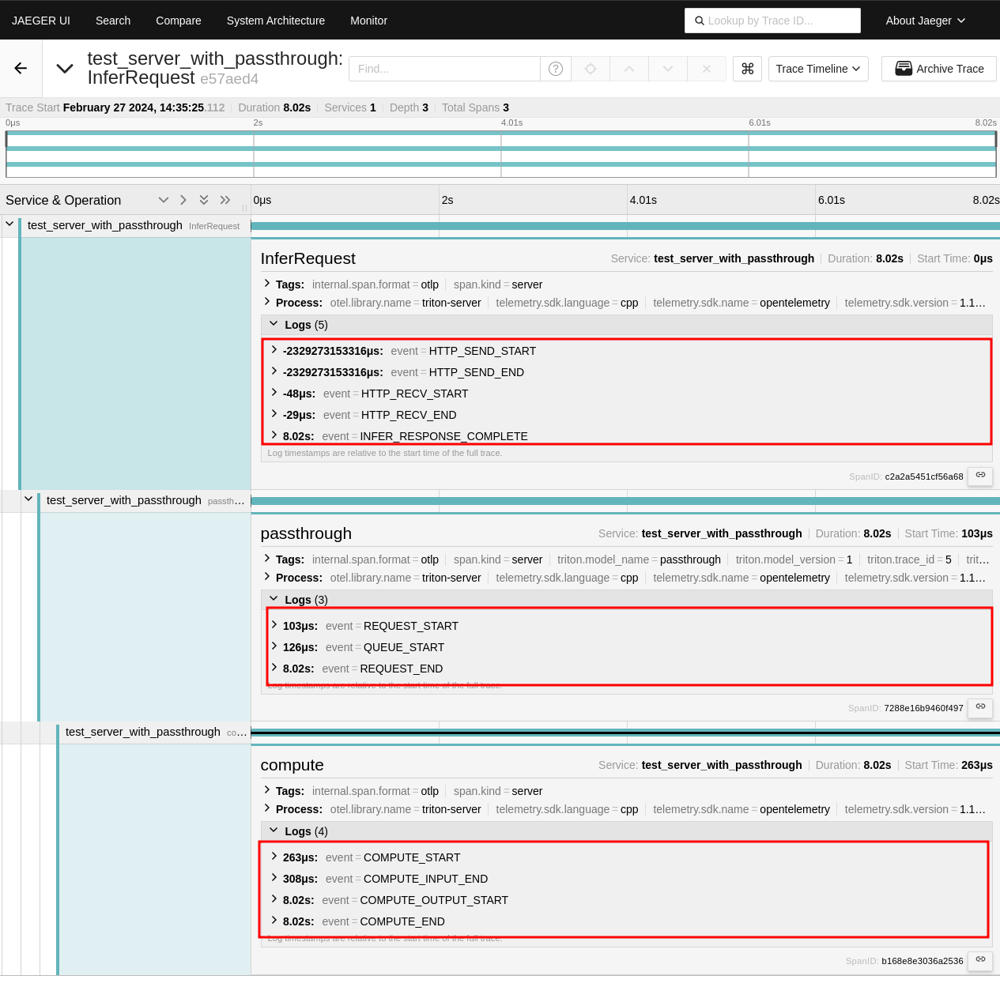
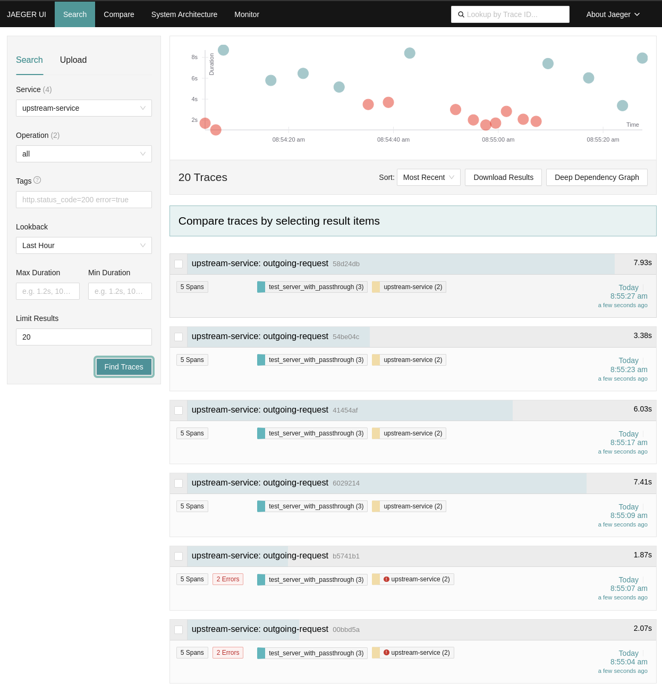

<!--
Copyright (c) 2024, NVIDIA CORPORATION. All rights reserved.

Licensed under the Apache License, Version 2.0 (the "License");
you may not use this file except in compliance with the License.
You may obtain a copy of the License at

    http://www.apache.org/licenses/LICENSE-2.0

Unless required by applicable law or agreed to in writing, software
distributed under the License is distributed on an "AS IS" BASIS,
WITHOUT WARRANTIES OR CONDITIONS OF ANY KIND, either express or implied.
See the License for the specific language governing permissions and
limitations under the License.
-->

# Distributed Tracing

Distributed tracing enables tracking application requests as they traverse through various services. This is crucial for monitoring the health and performance of distributed applications, especially in microservices architectures. This guide will demonstrate how to configure the Triton Inference Server to send traces to an OpenTelemetry collector and later visualize them.

## Setting Up the OpenTelemetry Environment

The OpenTelemetry collector serves to collect, process, and export traces and metrics. As a collector, you can utilize the [Jaeger](https://www.jaegertracing.io/) tracing platform, which also includes a UI for trace visualization. To run Jaeger backend components and the UI in a single container, execute the following command:

<!--pytest.mark.skip-->

```bash
docker run -d --name jaeger \
    -e COLLECTOR_OTLP_ENABLED=true \
    -p 4318:4318 \
    -p 16686:16686 \
    jaegertracing/all-in-one:1
```

This command will initiate a daemon mode HTTP trace collector listening on port 4318 and the Jaeger UI on port 16686. You can then access the Jaeger UI via [http://localhost:16686](http://localhost:16686). Further details on the parameters of this Docker image can be found in the [Jaeger Getting Started document](https://www.jaegertracing.io/docs/next-release/getting-started/#all-in-one).

## PyTriton and Distributed Tracing

With the [OpenTelemetry collector set up](#setting-up-the-opentelemetry-environment), you can now configure the Triton Inference Server tracer to send trace spans to it. This is achieved by specifying the `trace_config` parameter in the TritonConfig:

<!--pytest.mark.skip-->

```python
import time
import numpy as np
from pytriton.decorators import batch
from pytriton.model_config import ModelConfig, Tensor
from pytriton.triton import Triton, TritonConfig


@batch
def passthrough(sleep):
    max_sleep = np.max(sleep).item()
    time.sleep(max_sleep)
    return {"sleep": sleep}


with Triton(
    config=TritonConfig(
        trace_config=[
            "level=TIMESTAMPS",
            "rate=1",
            "mode=opentelemetry",
            "opentelemetry,url=127.0.0.1:4318/v1/traces",
            "opentelemetry,resource=service.name=test_server_with_passthrough",
            "opentelemetry,resource=test.key=test.value",
        ],
    )
) as triton:
    triton.bind(
        model_name="passthrough",
        infer_func=passthrough,
        inputs=[Tensor(name="sleep", dtype=np.float32, shape=(1,))],
        outputs=[Tensor(name="sleep", dtype=np.float32, shape=(1,))],
        config=ModelConfig(max_batch_size=128),
        strict=True,
    )
    triton.serve()
```

All the supported Triton Inference Server trace API settings are described in the [user guide on tracing](https://github.com/triton-inference-server/server/blob/main/docs/user_guide/trace.md).

Now, you can send requests with curl to the Triton Inference Server and analyze the trace visualizations in the Jaeger UI:

<!--pytest.mark.skip-->

```bash
curl http://127.0.0.1:8000/v2/models/passthrough/generate \
    -H "Content-Type: application/json" \
    -sS \
    -w "\n" \
    -d '{"sleep": 2}'
```





## OpenTelemetry Context Propagation

Triton Inference Server supports [OpenTelemetry context propagation](https://github.com/triton-inference-server/server/blob/main/docs/user_guide/trace.md#opentelemetry-context-propagation), enabling the tracing of requests across multiple services. This is particularly useful in microservices architectures where the Triton Inference Server is one of many services involved in processing a request.

To test this feature, you can use the following Python client based on python [requests](https://requests.readthedocs.io/en/latest/) package. This client will send a request to the Triton Inference Server and propagates its own OpenTelemetry context. First, install the required packages:

<!--pytest.mark.skip-->

```bash
pip install opentelemetry-api opentelemetry-sdk opentelemetry-instrumentation-requests opentelemetry-exporter-otlp
```

Then, run the following Python script:

<!--pytest.mark.skip-->

```python
import time
import requests

from opentelemetry import trace
from opentelemetry.sdk.resources import Resource
from opentelemetry.sdk.trace import TracerProvider
from opentelemetry.sdk.trace.export import BatchSpanProcessor
from opentelemetry.exporter.otlp.proto.http.trace_exporter import OTLPSpanExporter
from opentelemetry.instrumentation.requests import RequestsInstrumentor

# Enable instrumentation in the requests library.
RequestsInstrumentor().instrument()

# OTLPSpanExporter can be also configured with OTEL_EXPORTER_OTLP_TRACES_ENDPOINT environment variable
trace.set_tracer_provider(
    TracerProvider(
        resource=Resource(attributes={"service.name": "upstream-service"}),
        active_span_processor=BatchSpanProcessor(OTLPSpanExporter(endpoint="http://127.0.0.1:4318/v1/traces")),
    )
)


tracer = trace.get_tracer(__name__)
with tracer.start_as_current_span("outgoing-request"):
    time.sleep(1.0)
    response = requests.post(
        "http://127.0.0.1:8000/v2/models/passthrough/generate",
        headers={"Content-Type": "application/json"},
        json={"sleep": 2.0},
    )
    time.sleep(1.0)

print(response.json())
```

This script sends a request to the Triton Inference Server and propagates its own OpenTelemetry context. The Triton Inference Server will then forward this context to the OpenTelemetry collector, which will visualize the trace in the Jaeger UI.




You can see that the trace spans are now linked across the two services.